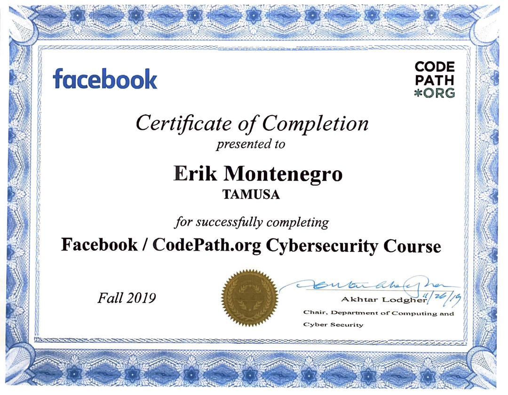

Course work focused on the fundamentals of web application security with the aim of providing a foundational level of knowledge matched with offensive and defensive skills developed through hands-on experience.  The certificate was earned by completing a Security Risk Analysis course at Texas A&M University - San Antonio.

# Skills Covered:
 Data Exposure
 Cookie and Session Based Attacks
 Malicious Input Attacks
 Cryptography
 User Authentication
 Network Security 
 Social Engineering
 

